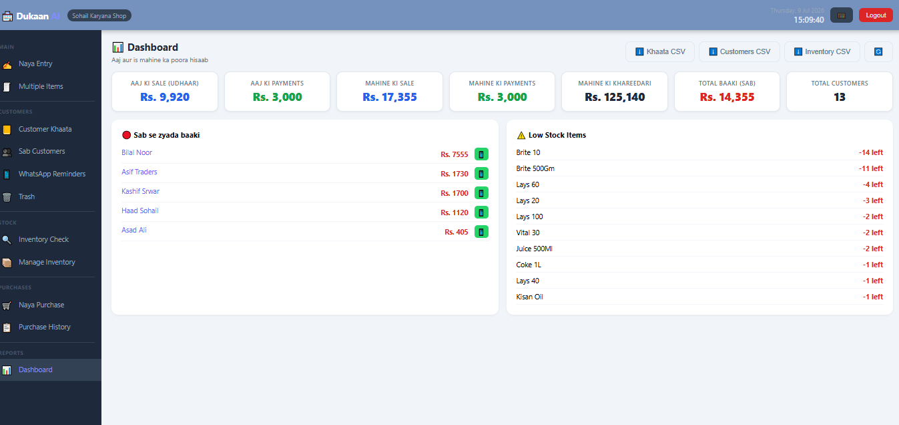
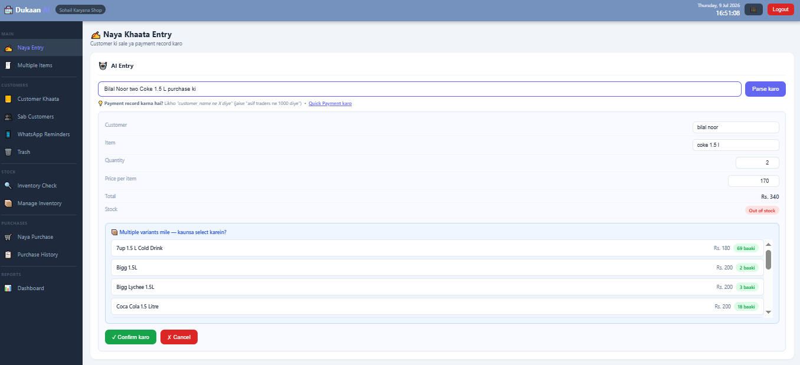
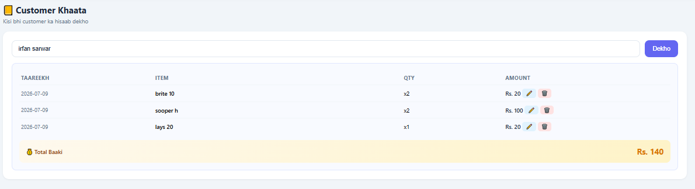
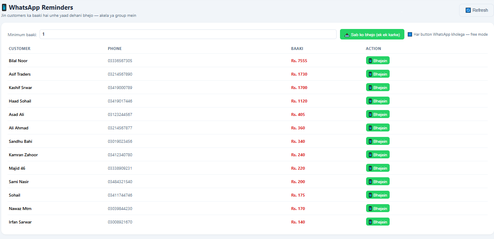
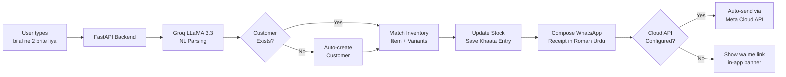

# 🏪 Dukaan AI

**AI-powered shop management for Pakistani retail — Urdu-first, WhatsApp-native**

**Pakistani karyana dukaanoun ke liye AI-powered management — Urdu mein baat karo, WhatsApp par receipt bhejo.**

> *"Bilal ne 2 brite liya"* → parsed, saved, WhatsApp receipt sent. Bas.


**[Live Demo](https://your-vercel-url.vercel.app)** · **[Screenshots](#-screenshots)** · **[Architecture](#-how-it-works)** · **[Roadmap](#-roadmap)** · **[Contact](#-contact)**

---

## 🎯 The Problem

Pakistan has over **2 million karyana (retail) shops**. Nearly all track customer credit (**udhaar/khaata**) on paper registers — leading to lost entries, forgotten dues, and hours of manual reconciliation each week. Existing digital solutions are English-only, expensive, or built for large retailers — none understand how a Pakistani dukaandaar actually speaks.

**اردو میں:** Pakistan mein 20 lakh se zyada karyana dukaanein hain. Zyada tar abhi bhi paper register par khaata rakhte hain — entries kho jati hain, baaki bhool jata hai, aur har hafte hisaab lagane mein ghante lag jate hain. Jo digital software available hain wo mostly English mein hain, mehnge hain, ya bare stores ke liye banaye gaye hain — koi bhi wo language nahi samajhta jo Pakistani dukaandaar bolta hai.

---

## 💡 The Solution

Dukaan AI is a multi-tenant SaaS that lets shop owners record sales, payments, and inventory in **natural Roman Urdu** — the way they'd say it out loud to a helper. AI parses the text, matches items to inventory, updates stock, and can push WhatsApp receipts to customers automatically.

**اردو میں:** Dukaan AI ek multi-tenant SaaS hai jo dukaan malikoon ko sales, payments, aur inventory ka record Roman Urdu mein rakhne deta hai — bilkul jaise wo apne mundhi ko bolte hain. AI text samajhti hai, item inventory se match karti hai, stock update karti hai, aur customer ko WhatsApp par receipt automatically bhej deti hai.

Built specifically for Pakistan: Roman Urdu UI, Pakistani phone number handling, and message templates designed for local shop culture.

---

## ✨ Key Features

### 🤖 Natural Language AI Entry / Roman Urdu se Entry

Type or paste plain Urdu/English:

> *"asif traders ne 3 data 1kg aur 2 sooper h liye"*

AI extracts customer, items, quantities, and prices. Matches against 279+ inventory items, handles variants (Lays 20/40/60/70), warns on out-of-stock.

**اردو:** AI khud customer, item, quantity, aur price extract karti hai. 279+ items ka inventory match karti hai, variants handle karti hai (Lays 20/40/60/70), aur out-of-stock ka warning deti hai.

---

### 📱 WhatsApp Integration (Two Modes) / WhatsApp Reminders

- **Free mode**: `wa.me` click-to-chat links with pre-filled Roman Urdu receipts
- **Auto mode**: Meta Cloud API integration — receipts sent automatically after every entry/payment
- **Bulk reminders**: One-click WhatsApp to all customers with pending balances

**اردو:** Do modes hain — Free mode mein `wa.me` link banti hai jis se WhatsApp khul jata hai ready receipt ke saath. Auto mode mein Meta Cloud API se message khud bhej jata hai. Bulk reminders se ek click mein sab defaulters ko WhatsApp kar sakte hain.

---

### 📊 Real-time Dashboard / Live Dashboard

Today's sale + payments, monthly totals, purchases, top defaulters, low-stock alerts — all updated live. CSV exports for accounting.

**اردو:** Aaj ki sale + payments, is mahine ka poora hisaab, khareedari, sab se zyada baaki wale customer, low stock warnings — sab live update hote hain. CSV export bhi ho jata hai.

---

### 🗑️ Soft Delete + Trash / Trash Bin

Every deleted entry is recoverable for 30 days. No panic when a helper deletes the wrong row.

**اردو:** Har delete ki hui entry 30 din tak wapas la sakte hain. Agar mundhi galti se koi row delete kar de, tension nahi.

---

### 🔐 Multi-tenant Architecture / Har Shop Alag

Each shop gets isolated data. JWT auth, rate-limited login (10/min), password reset via shop identity verification.

**اردو:** Har dukaan ka apna alag data — koi doosri dukaan ka nahi dekh sakta. JWT se secure login, rate limiting brute force attacks ke liye, aur password reset shop identity verification se hota hai.

---

### 🛒 Inventory + Purchases / Stock aur Khareedari

Full CRUD for items with sale price, purchase rate, stock, and reorder levels. Purchase entries auto-update stock. Google Sheets bulk import supported.

**اردو:** Items add, edit, delete kar sakte hain — sale price, purchase rate, stock, aur reorder level ke saath. Khareedari save karte hi stock update ho jata hai. Google Sheets se bulk import bhi kar sakte hain.

---

### 💰 Quick Payment / Payment Save Karo

Dedicated Quick Payment button with customer autocomplete (showing pending baaki). No AI parsing needed — click, select customer, enter amount, done.

**اردو:** Quick Payment button hai — customer ka naam type karo, autocomplete se select karo (baaki bhi dikhti hai), amount daalo, save. AI parsing ka intezaar nahi.

---

## 📸 Screenshots

### Dashboard — Live business snapshot



*Rs. 9,920 today's sale · Rs. 17,355 this month · 13 customers · Top defaulters with WhatsApp buttons*

### AI Natural Language Parsing



*Multi-item parsing with automatic variant matching and stock warnings*

### Inventory with Smart Variant Matching



*Search "7up" returns 4 variants: 1 Litre, 1.5L, 2.25 Litre, regular — each with stock badges*

### WhatsApp Bulk Reminders



*One-click reminder to all 13 customers with pending balances (Rs. 14,355 total)*

---

## 🏗️ How It Works



---

## 🛠️ Tech Stack

| Layer | Technology | Why |
|---|---|---|
| Backend | FastAPI + Pydantic v2 | Async, type-safe, auto OpenAPI docs |
| Database | PostgreSQL (Supabase) | Multi-tenant with row-level isolation via `shop_id` |
| AI/LLM | Groq LLaMA 3.3 70B | Fast inference, low cost, understands Roman Urdu |
| Auth | JWT + python-jose | Stateless, works well on serverless |
| Rate Limiting | slowapi | Protects auth endpoints from brute force |
| Frontend | Vanilla HTML/CSS/JS | Zero build step, works everywhere |
| Hosting | Vercel (serverless) | Free tier fits SMB usage; auto-deploy from `main` |
| WhatsApp | wa.me links + Meta Cloud API | Free by default, upgradable to auto-send |

---

## 🚀 Quick Start

```bash
# 1. Clone
git clone https://github.com/sohail2365/dukaan-ai.git
cd dukaan-ai

# 2. Setup virtual environment
python -m venv .venv
source .venv/bin/activate    # Windows: .venv\Scripts\activate
pip install -r requirements.txt

# 3. Configure environment
cp .env.example .env
# Fill in: GROQ_API_KEY, DATABASE_URL, SECRET_KEY

# 4. Run
uvicorn server:app --reload

# 5. Open browser
# http://localhost:8000/ui
```

<details>
<summary><b>Optional: WhatsApp Cloud API for auto-send</b></summary>

Free mode works with `wa.me` links (no setup). For automatic message sending:

1. Create a Meta Business App at [developers.facebook.com](https://developers.facebook.com)
2. Add the WhatsApp product → Cloud API
3. Get your Access Token and Phone Number ID
4. Add to `.env`:
   ```
   WHATSAPP_TOKEN=EAAG...
   WHATSAPP_PHONE_ID=1234567890
   ```
5. Restart the server. Every entry now auto-sends a receipt.

**Free tier**: 1000 conversations/month. Phone verification required for production.

</details>

<details>
<summary><b>Optional: Google Sheets bulk import</b></summary>

Place a Google Service Account `credentials.json` in the project root, then:

```bash
python import_sheet.py
```

Reads a sheet with columns `item_name, category, sale_price, purchase_rate, stock` and bulk-inserts into inventory.

</details>

<details>
<summary><b>Optional: Automated backups</b></summary>

```bash
python backup.py                 # all shops, JSON format
python backup.py --shop-id 1     # specific shop
python backup.py --format csv    # CSV format
```

Schedule with cron:

```
0 3 * * * cd /path/to/dukaan-ai && python backup.py --output /var/backups/dukaan
```

Or use Vercel Cron / cron-job.org for hosted deployments.

</details>

---

## 🌐 Deployment

Configured for **Vercel** serverless deployment. Add environment variables in the Vercel dashboard, connect the repo, and every push to `main` auto-deploys.

```bash
vercel --prod
```

`vercel.json` handles routing. `NullPool` in SQLAlchemy ensures compatibility with serverless cold starts.

---

## 📚 API Reference

<details>
<summary><b>Click to expand full endpoint list</b></summary>

### Auth (rate-limited)
- `POST /auth/register` — 5/hour
- `POST /auth/login` — 10/minute
- `POST /auth/reset-password` — 3/hour

### Entries
- `POST /entry/parse` — AI parse without saving
- `POST /entry/save` — save single entry (returns WhatsApp payload)
- `POST /entry/multi/parse` — parse multi-item statement
- `POST /entry/multi/save` — save multi-item entry with bill printing
- `PUT /entry/edit` — edit existing entry
- `DELETE /entry/{id}` — soft delete (30-day recovery window)

### Khaata & Customers
- `GET /khaata/{customer_name}` — full transaction history
- `GET /customers/all` — searchable list with totals
- `POST /customer/add`, `PUT /customer/edit`, `DELETE /customer/{name}`
- `POST /customer/set-phone` — inline phone save from WhatsApp dialog

### Inventory
- `GET /inventory/all` — full catalog with stats
- `GET /inventory/{item_name}` — smart search returning all variants
- `POST /inventory/add`, `PUT /inventory/edit`, `DELETE /inventory/item/{id}`

### Purchases
- `POST /purchase/parse` — AI parse purchase entry
- `POST /purchase/save` — record purchase, auto-increment stock
- `GET /purchases/all`, `PUT /purchase/edit`, `DELETE /purchase/{id}`

### WhatsApp
- `POST /whatsapp/reminder` — single customer reminder
- `POST /whatsapp/bulk-reminders` — all defaulters above `min_baaki`

### Reports & Trash
- `GET /reports/dashboard` — real-time stats
- `GET /export/{customers|khaata|inventory}` — CSV downloads
- `GET /trash/khaata` — recently deleted entries
- `POST /trash/restore/{id}` — restore entry
- `DELETE /trash/purge` — permanent delete of 30+ day old items

</details>

---

## 🗺️ Roadmap

These features are available on client request. Ye features on-demand available hain — client ki zaroorat par implement hote hain.

### 🖨️ Thermal Receipt Printing / Thermal Printer Support

**EN:** Direct integration with 58mm / 80mm thermal printers via ESC/POS protocol. Print receipts, customer statements, and end-of-day summaries. Works with cheap USB thermal printers commonly used in Pakistani shops (Rs. 4,000 – Rs. 12,000 range).

**اردو:** 58mm ya 80mm thermal printer se seedha connect ho jayega — ESC/POS protocol se. Receipt, khaata statement, aur din ki closing print kar sakte hain. Pakistani shops mein common USB thermal printers ke saath kaam karega.

*Delivery: 3–5 days.*

---

### 👥 Staff Accounts + Role-Based Permissions / Staff Accounts

**EN:** Owner, Manager, and Cashier roles with granular permissions. Cashier can only make entries — cannot delete customers or view profit margins. Full audit log of who did what and when.

**اردو:** Owner, Manager, aur Cashier — teen roles. Cashier sirf entries kar sakega, customer delete ya profit nahi dekh sakega. Audit log hoga — kaun ne kya, kab kiya sab record honga.

*Delivery: 1 week.*

---

### 💬 Customer WhatsApp Chatbot (Two-way) / Customer Ke Liye WhatsApp Bot

**EN:** Customer texts `"baaki?"` on the shop's WhatsApp number and instantly receives their full khaata statement — total dues, last 5 transactions, WhatsApp link to shop for payment. Reduces "kitni baaki hai?" calls by 80%. Uses Meta WhatsApp Business API webhooks.

**اردو:** Customer shop ke WhatsApp number pe `"baaki?"` bheje, aur usko turant apna khaata mil jaye — total baaki, last 5 entries, aur shop se contact ka link. "Kitni baaki hai?" wale calls 80% kam ho jayenge. Meta WhatsApp Business API webhooks se banega.

*Delivery: 2 weeks.*

---

### 📈 AI Sales Predictions / Sales Forecasting

**EN:** After 3+ months of data, ML model predicts weekly/monthly demand per item — helps dukaandaar order the right quantities. Seasonal awareness (Eid demand spike for oil, ghee, dry fruits). Uses lightweight time-series forecasting (Prophet or ARIMA).

**اردو:** 3 mahine ka data ho jaye toh ML model har item ka weekly/monthly demand predict kar dega — dukaandaar ko sahi quantity order karne mein madad. Eid, Ramzan wagera ka spike bhi samajh legi. Prophet ya ARIMA jaisa lightweight model.

*Delivery: 3 weeks (needs 3+ months of data first).*

---

### 📱 Mobile App (PWA + Native) / Mobile App

**EN:** Progressive Web App works offline, installs to home screen, feels like a native app — with camera access for barcode scanning and voice input for entries. Native Android/iOS app available on request via React Native.

**اردو:** PWA offline chalega, phone ke home screen pe install ho jaye ga, native app jaisa lagega — camera se barcode scan, voice se entry. React Native se pure native Android/iOS app bhi ban sakti hai.

*Delivery: PWA 1 week / Native 3–4 weeks.*

---

### 💳 Payment Gateway Integration / JazzCash / EasyPaisa

**EN:** Accept payments directly from customers via JazzCash and EasyPaisa. Generate a payment link per customer, embed in WhatsApp receipts. When payment arrives, khaata auto-updates. Full webhook integration.

**اردو:** JazzCash aur EasyPaisa se seedha customer se payment le sakte hain. Har customer ka apna payment link banega jo WhatsApp receipt mein aayega. Payment aane pe khaata khud update ho jayega. Complete webhook integration ke saath.

*Delivery: 2 weeks.*

---

## 💼 About This Project

Built solo over 3 months by a self-taught developer in rural Pakistan. Design decisions reflect real-world constraints from running my own karyana shop while learning to code — every feature exists because a paper-register workflow was slow or error-prone.

**Ye project 3 mahine mein solo banaya — rural Pakistan mein reh kar, apna karyana shop chalane ke saath saath coding seekhi. Har feature is liye add hui hai kyunki paper register wala tareeqa slow ya error-prone tha.**

### What this project demonstrates:

- **End-to-end SaaS architecture** — auth, multi-tenancy, deployment, monitoring
- **LLM integration in production** — Groq for NL parsing, WhatsApp Cloud API for auto-messaging
- **Culturally-informed UX design** — Roman Urdu, Pakistani phone formats, local shop patterns
- **Reliability engineering** — soft delete, rate limiting, structured logging, non-destructive migrations
- **Client-ready deliverables** — Vercel deployment, CSV exports, backup scripts, WhatsApp integration

---

## 📬 Contact / Rabta

**Sohail** — Applied LLM / Backend Engineer

Available for remote contract work: FastAPI backends, LLM/RAG pipelines, WhatsApp integrations, multi-tenant SaaS.

**Remote clients ke liye available — FastAPI backend, LLM/RAG pipelines, WhatsApp integrations, aur multi-tenant SaaS projects.**

- 💻 **GitHub:** [@sohail2365](https://github.com/sohail2365)
- 💼 **Upwork:** `[Add your Upwork profile URL]`
- 🔗 **LinkedIn:** `[Add your LinkedIn URL]`
- ✉️ **Email:** `[Add your email]`

---

*Built in rural Pakistan 🇵🇰 · Powered by FastAPI, Groq, and Supabase*
